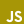

  <h1>Ziphil Aleshlas</h1>

  <i>May everything be made by lines of code.</i>

  <h3>— Skills —</h3>

<table align="center">
  <tr>
    <td rowspan="2"><b>Proficient</b></td>
    <td colspan="5">Languages</td><td colspan="3">Frameworks</td>
  </tr>
  <tr>
    <td width="80" align="center">TypeScript </td>
    <td width="80" align="center">JavaScript </td>
    <td width="80" align="center">Ruby </td>
    <td width="80" align="center">HTML </td>
    <td width="80" align="center">SCSS </td>
    <td width="80" align="center">React </td>
    <td width="80" align="center">Electron </td>
    <td width="80" align="center">Webpack </td>
  </tr>
  <tr>
    <td rowspan="2"><b>Intermediate</b></td>
    <td colspan="5">Languages</td><td colspan="3">Frameworks</td>
  </tr>
  <tr>
    <td width="80" align="center">Java </td>
    <td width="80" align="center">Haskell </td>
    <td width="80" align="center">LaTeX </td>
    <td colspan="2"></td>
    <td width="80" align="center">MongoDB </td>
    <td width="80" align="center">Heroku </td>
    <td colspan="1"></td>
  </tr>
  <tr>
    <td rowspan="2"><b>Learning</b></td>
    <td colspan="5">Languages</td><td colspan="3">Frameworks</td>
  </tr>
  <tr>
    <td width="80" align="center">Kotlin </td>
    <td width="80" align="center">C# </td>
    <td width="80" align="center">Python </td>
    <td colspan="2"></td>
    <td width="80" align="center">vue.js </td>
    <td width="80" align="center">Unity </td>
    <td width="80" align="center">AWS </td>
  </tr>
</table>

  <h3>— Main Products —</h3>

 

For more information about my works, please visit [here](https://github.com/Ziphil/Repositories), where you will find a curated list of my repositories with brief explanations.

  <h3>— Links —</h3>

  <a href="https://twitter.com/Ziphil"> Twitter</a>
  &nbsp;·&nbsp;
  <a href="https://www.youtube.com/channel/UCF2sTP1NGBVFr79aJiKprsg"> YouTube</a> 
  <a href="http://ziphil.com">My Webpage</a>

